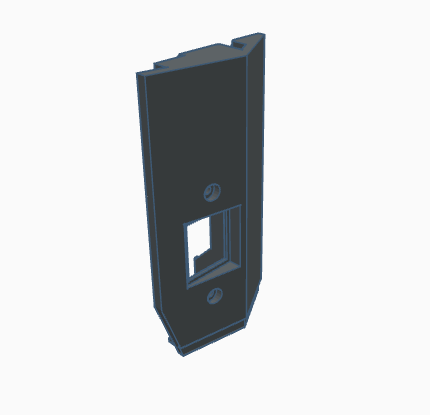
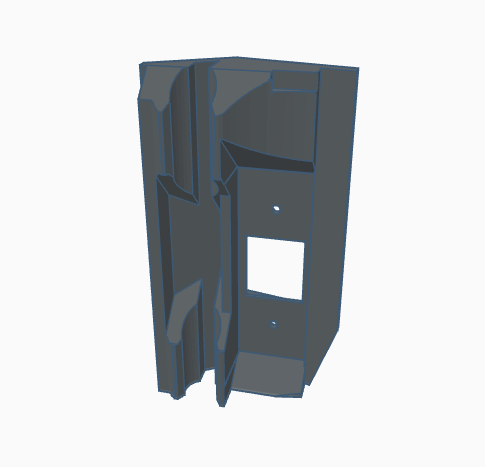
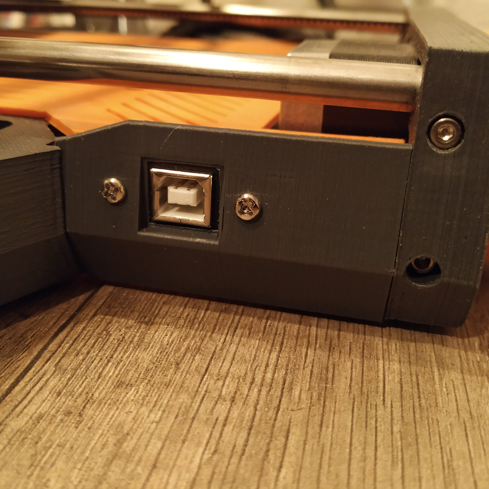

# DEU-CCCS000-main (DiscoEasy & Ultimate - Cache côté court avec USB)

## Informations

**Version**: `1.0`

**Reference**: `DEU-CCCS000-main`

**Name**: `DiscoEasy & Ultimate - Cache côté court avec USB`

**Compatibility**: 
- DiscoEasy200
- DiscoUltimate

**Description**: 
- 🌍 🇫🇷 : Conçu pour accueillir une rallonge USB (espacement des vis: 26mm)
- 🌎 🇺🇸 : Designed to support USB extension cable (space between screws: 26mm)

## Printing details

|Infill   |Supports         |Rafts            |Resolution   |Filament   |
|-        |-                |-                |-            |-          |
|17%      |Doesn't matter   |Doesn't matter   |0.20mm       |PLA        |

## Images

## Platforms

- [Thingiverse](https://www.thingiverse.com/thing:4180118)